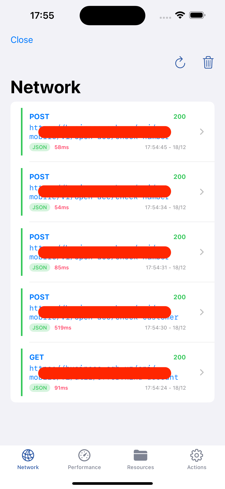
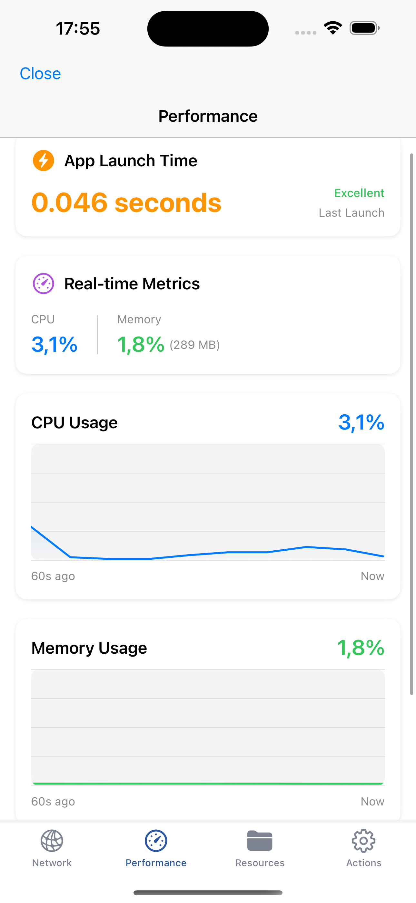
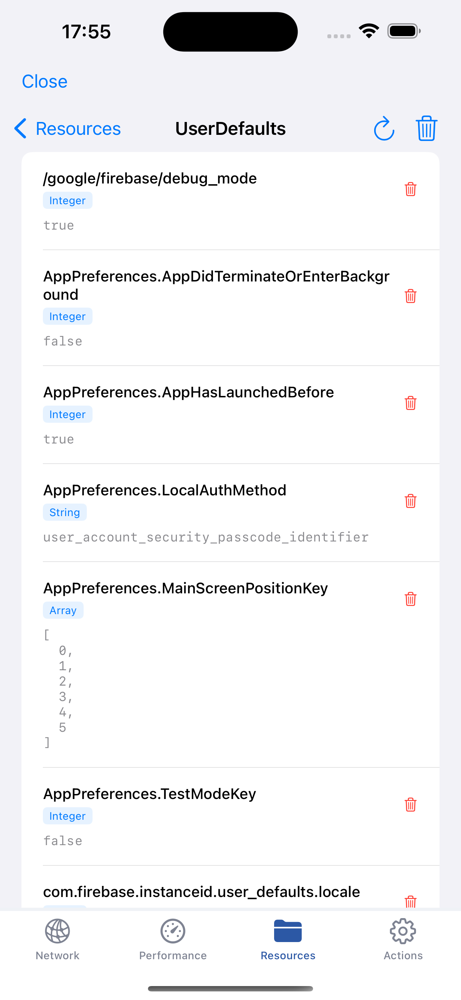
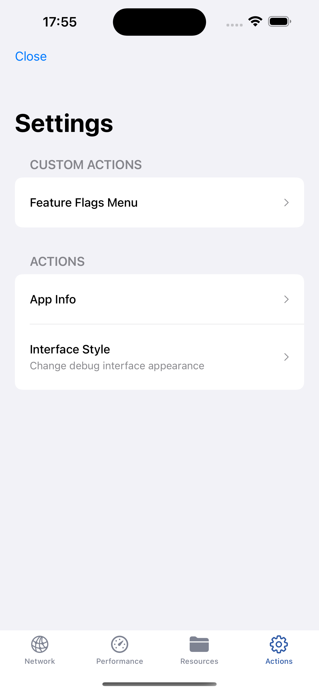
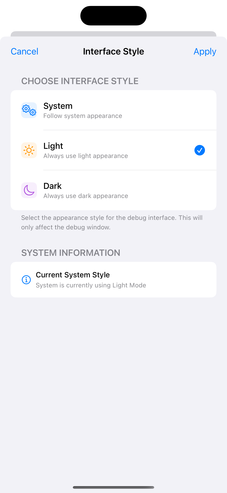
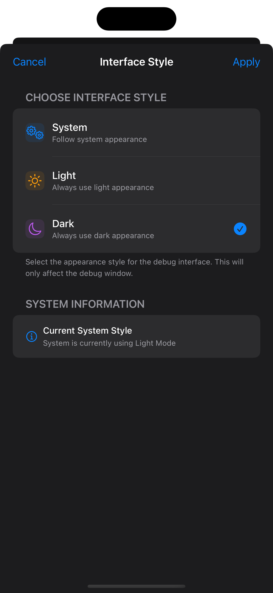

# BNDebugger

[](https://github.com/botirjon/BNDebugger/releases)
[](https://swift.org)
[](https://developer.apple.com/ios/)
[](https://swift.org/package-manager/)
[](LICENSE)

A comprehensive debugging toolkit for iOS applications that provides real-time monitoring and inspection capabilities for network requests, app performance, file system resources, and app configuration.

## Why BNDebugger?

**This package does not use method swizzling**, unlike many other debugging tools. This makes it compatible with dependencies that restrict or prohibit method swizzling in your app.

This package was made out of necessity — there are far more advanced debugging tools out there, however, if they cannot be used due to method swizzling restrictions, BNDebugger is an excellent alternative.

## Features

- **Network Monitoring** - Intercept and inspect all HTTP/HTTPS requests with full request/response details including headers, body, status codes, and response times
- **Performance Monitoring** - Real-time CPU and memory usage tracking with historical data visualization
- **Resource Browser** - Browse and inspect app resources including Documents folder, Temp folder, and UserDefaults
- **Custom Actions** - Add your own debug actions for quick access during development
- **Non-intrusive UI** - Floating draggable button that doesn't interfere with your app's interaction
- **Multi-language Support** *(Coming Soon)* - Currently English only. Russian and Uzbek support is planned

## Screenshots

<p align="center">
  
  
  
</p>
<p align="center">
  
  
  
</p>

## Requirements

- iOS 14.0+
- Swift 5.9+
- Xcode 15.0+

## Installation

### Swift Package Manager

Add BNDebugger to your project using Swift Package Manager:

#### Using Xcode

1. Go to **File > Add Package Dependencies...**
2. Enter the repository URL:
   ```
   https://github.com/botirjon/BNDebugger.git
   ```
3. Select the version rule (e.g., "Up to Next Major Version")
4. Click **Add Package**

#### Using Package.swift

Add the following to your `Package.swift` file:

```swift
dependencies: [
    .package(url: "https://github.com/botirjon/BNDebugger.git", from: "1.0.0")
]
```

Then add `BNDebugger` to your target's dependencies:

```swift
.target(
    name: "YourTarget",
    dependencies: ["BNDebugger"]
)
```

## Usage

### Basic Setup

Start debugging in your `AppDelegate` or `SceneDelegate`:

```swift
import BNDebugger

// In your app launch method
DebugManager.shared.startDebugging(
    with: DebugInterfaceConfig(
        language: .english,
        userInterfaceStyle: .system
    )
)
```

To stop debugging:

```swift
DebugManager.shared.stopDebugging()
```

### Configuration Options

```swift
// Available languages
public enum DebugLanguage {
    case uzbek
    case english
    case russian
}

// Configuration
public struct DebugInterfaceConfig {
    public var language: DebugLanguage
    public var userInterfaceStyle: UIUserInterfaceStyle?
}
```

> **Note:** The `language` option is currently a work in progress. Only English is supported at this time. Russian and Uzbek support will be added in a future release.

### Custom Debug Actions

Add your own debug actions that appear in the Actions tab:

```swift
DebugManager.shared.customActions = [
    CustomDebugAction(
        title: "Clear Cache",
        description: "Remove all cached data",
        action: {
            // Your custom action code
            CacheManager.shared.clearAll()
        }
    ),
    CustomDebugAction(
        title: "Reset Onboarding",
        description: "Show onboarding flow again",
        action: {
            UserDefaults.standard.set(false, forKey: "hasSeenOnboarding")
        }
    )
]
```

### Alamofire Integration

BNDebugger uses `URLProtocol` for network interception, which doesn't automatically capture requests made through Alamofire's custom session. To enable network monitoring for Alamofire requests, create a custom session with `DebugURLProtocol`:

```swift
import Alamofire
import BNDebugger

extension Alamofire.Session {
    static var debuggableSession: Alamofire.Session {
        let sessionConfiguration = URLSessionConfiguration.default
        #if DEBUG || STAGING
        sessionConfiguration.protocolClasses = [DebugURLProtocol.self] +
            (sessionConfiguration.protocolClasses ?? [])
        #endif
        return Alamofire.Session(configuration: sessionConfiguration)
    }
}
```

Then use this session for your network requests:

```swift
self.session = .debuggableSession
let request = session.request(urlRequest, interceptor: NetworkInterceptor.shared).validate()
```

## Debug Interface

The debug interface provides four main tabs:

### Network Tab
- View all intercepted network requests
- See request/response headers and body
- Monitor response times and status codes
- Clear request history

### Performance Tab
- Real-time CPU usage percentage
- Memory usage in MB and percentage
- Historical performance graphs
- App launch time

### Resources Tab
- Browse Documents folder
- Browse Temp folder
- View and edit UserDefaults
- Preview file contents (text and binary)
- Delete files

### Actions Tab
- View app information (version, build, bundle ID)
- Change interface style (Light/Dark/System)
- Access custom debug actions

## Architecture

BNDebugger uses a hybrid UIKit/SwiftUI architecture with MVVM pattern:

- **DebugManager** - Singleton managing the debugging lifecycle
- **DebugURLProtocol** - Custom URLProtocol for network interception
- **PerformanceMonitor** - CPU and memory tracking using mach kernel APIs
- **NetworkInterceptor** - Thread-safe request storage and management

> **Note:** Currently, reading performance metrics and fetching/displaying network requests is implemented via a polling mechanism. Future releases will transition to a more elegant event-based approach.

## License

BNDebugger is available under the MIT License. See the [LICENSE](LICENSE) file for more info.

## Author

Botirjon Nasridinov

## Contributing

Contributions are welcome! Please feel free to submit a Pull Request.
